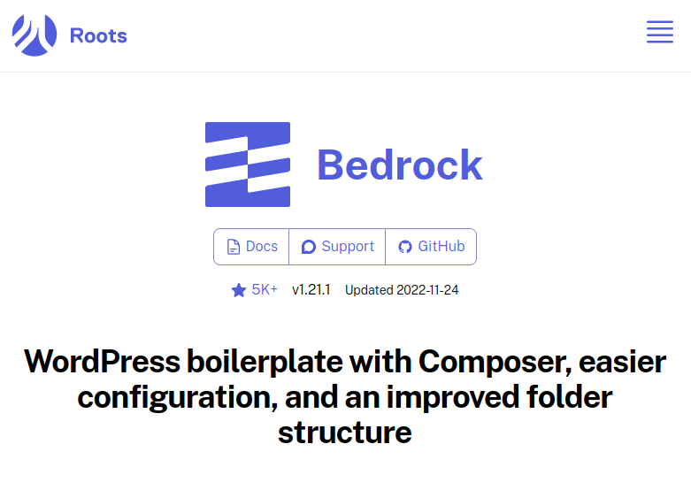
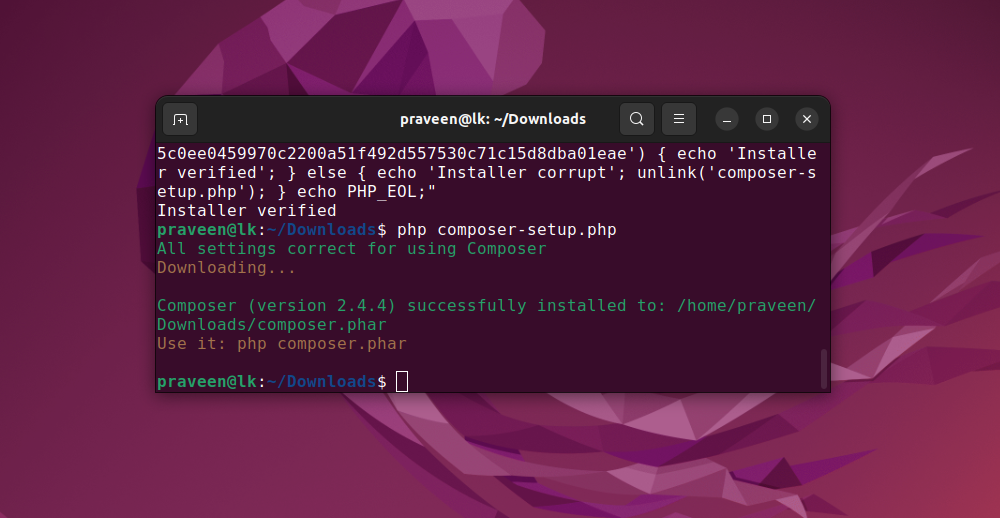
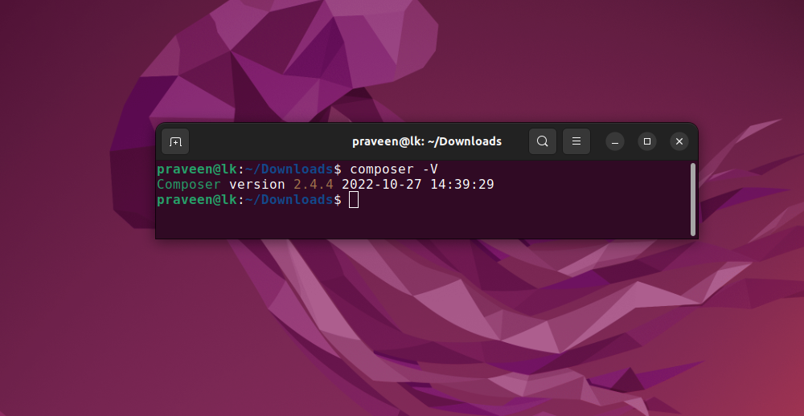
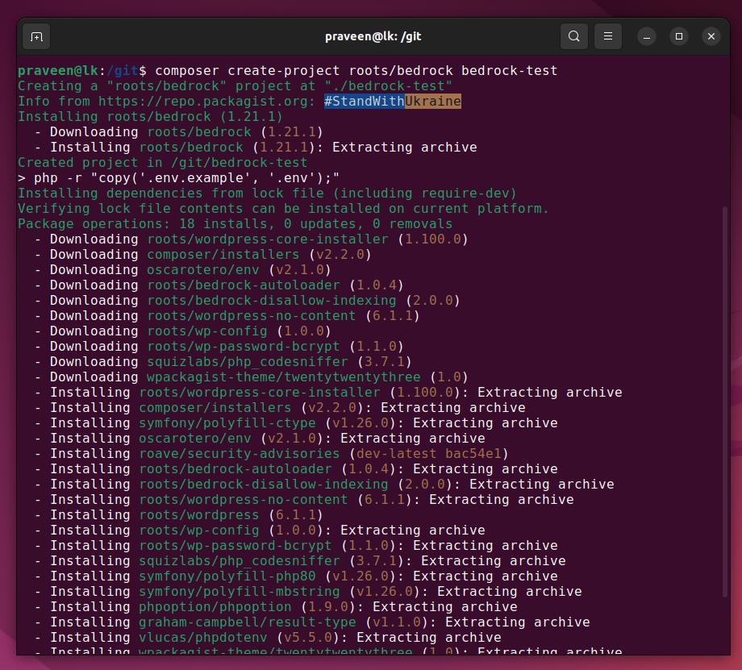

# BedRock

https://roots.io/bedrock/



## Install Composer

```
php -r "copy('https://getcomposer.org/installer', 'composer-setup.php');"
php -r "if (hash_file('sha384', 'composer-setup.php') === '55ce33d7678c5a611085589f1f3ddf8b3c52d662cd01d4ba75c0ee0459970c2200a51f492d557530c71c15d8dba01eae') { echo 'Installer verified'; } else { echo 'Installer corrupt'; unlink('composer-setup.php'); } echo PHP_EOL;"
php composer-setup.php
php -r "unlink('composer-setup.php');"
```


## Move to `/usr/local/bin/`

```
sudo mv composer.phar /usr/local/bin/composer
```



# BedRock create-project

```
composer create-project roots/bedrock
```



# Create a Virtual Host

```
<VirtualHost *:80>
    ServerName bedrock.test
    ServerAlias www.bedrock.test 
    ServerAdmin webmaster@localhost
    DocumentRoot /var/www/bedrock.test
    ErrorLog /var/www/bedrock.test/error.log
    CustomLog /var/www/bedrock.test/access.log combined
</VirtualHost>
<Directory /var/www/bedrockwp.test/>
	AllowOverride All
</Directory>
```

## Enable the site

```
sudo a2ensite bedrock.test.conf
sudo systemctl reload apache2
```

Add the new host to `/etc/hosts` file.
